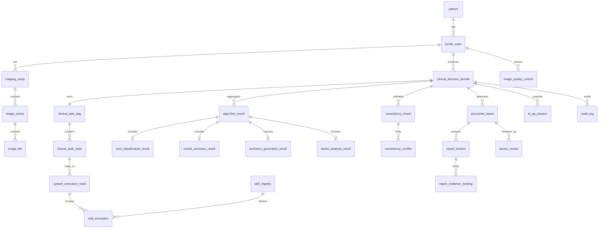

# StrokeClaw 卒中智能体字段表梳理（最新版）

> 生成时间：2026-07-07  
> 文档用途：用于 StrokeClaw 卒中智能体项目的工程交接、数据库/接口/schema 设计、Agent Cockpit 展示设计，以及大计赛国赛答辩材料整理。  
> 本文档只做字段体系梳理，不修改代码、不修改数据库、不生成 migration。  

## 1. 文档说明

### 1.1 当前版本依据

本字段表基于以下项目现状整理：

| 依据类型 | 位置/对象 | 说明 |
|---|---|---|
| 当前字段表文档 | `docs/StrokeClaw_卒中智能体字段表总览.md` | 现有字段总览，覆盖 SQL、Flask API、前端、算法 JSON、Agent 运行态。 |
| 优化版字段表设计 | `docs/StrokeClaw_卒中智能体项目优化版字段表设计方案.md` | 面向国赛答辩和工程落地的优化字段体系。 |
| 当前 SQL | `sql/PATIENT_INFO_TANLE.sql`、`sql/SUPABASE_IMAGING_TABLE.sql`、`sql/availabale_modalities.sql` | 当前已存在或预期存在的 Supabase 表字段。 |
| 后端主链路 | `backend/app.py` | Flask API、上传任务、Agent run/event、报告生成、Cockpit 聚合。 |
| 兼容层 | `backend/compat/` | 已新增的字段兼容对象、Skill Registry 和 legacy-to-new adapter。 |
| 前端页面 | `static/js/*.js`、`frontend/src/*.jsx` | 病例录入、上传、处理页、报告页、Cockpit 页面字段使用。 |

### 1.2 低风险原则

当前系统已经有可运行主链路，因此字段体系优化必须遵循：

| 原则 | 说明 |
|---|---|
| 不删除旧字段 | `patient_info`、`patient_imaging`、`analysis_result`、`report_payload`、`AGENT_RUNS`、`AGENT_EVENTS` 均保留。 |
| 不重命名旧字段 | 前端、报告页、上传页、AI 问答、Agent Cockpit 已依赖旧字段。 |
| 不改变旧 API response | 旧接口继续保持原有返回结构。 |
| 新字段先做镜像层 | 新字段优先通过 adapter / view object 输出，不直接替换旧链路。 |
| migration 必须 add-only | 后续若落库，只允许新增表/字段，不 drop、不 rename、不修改旧字段类型。 |

### 1.3 字段状态分类

| 状态 | 含义 |
|---|---|
| 已存在 | 当前 SQL、后端 API、内存态、前端、算法 JSON 或 localStorage 中已经出现。 |
| 已兼容层实现 | 当前已在 `backend/compat` 中作为 schema / adapter / view object 实现。 |
| 建议新增 | 优化版字段体系需要，但当前尚未稳定实现或落库。 |

## 2. 当前字段分布总览

| 字段来源 | 当前结构 | 代表字段 | 当前问题 | 优化方向 |
|---|---|---|---|---|
| SQL 表 | `patient_info` | `patient_name`、`patient_age`、`admission_nihss`、`core_infarct_volume`、`mismatch_ratio` | 患者信息、临床信息、算法结果混表 | 保留旧表，未来拆出 `clinical_context`、`stroke_analysis_result`。 |
| SQL 表 | `patient_imaging` | `patient_id`、`case_id`、`available_modalities`、`analysis_result`、`report_payload` | 影像、算法、报告 payload 聚合过粗 | 保留旧表，新增 adapter 输出影像上下文、算法结果、报告证据绑定。 |
| 后端内存态 | `AGENT_RUNS` | `run_id`、`status`、`stage`、`planner_input`、`steps`、`tool_results`、`review_state` | 未持久化，结构偏运行态 | 映射为 `agent_session`、`clinical_task_dag`、`skill_invocation`。 |
| 后端内存态 | `AGENT_EVENTS` | `event_id`、`event_seq`、`tool_name`、`input_ref`、`output_ref`、`latency_ms`、`status` | 事件字段可展示但未标准化 | 映射为 `agent_event`、`system_execution_node`、`skill_invocation`。 |
| 算法 JSON | `analysis_result`、三分类输出、Grad-CAM、CTP 产物 | `core_volume_ml`、`penumbra_volume_ml`、`mismatch_ratio`、`three_class_label` | 算法结果分散，未统一结果表 | 输出 `ncct_classification_result`、`stroke_analysis_result` 等。 |
| 报告 payload | `report_payload` | `final_report`、`evidence_items`、`evidence_map`、`traceability`、`question_answer` | 报告、证据、问答混在 JSON | 拆成 `structured_report`、`report_section`、`report_evidence_binding`。 |
| 前端表单 | `static/js/patient.js`、`static/js/upload.js` | `patient_name`、`patient_age`、`ncct_file`、`mcta_file`、`file_id` | 字段命名仍是旧链路 | 保持不变，通过 adapter 映射到新字段。 |
| localStorage | 报告/处理/Cockpit 页面 | `ai_report_payload_<file_id>`、`latest_agent_run_<file_id>`、`strokeclaw_review_state_<run_id>` | 跨页面临时状态依赖强 | 保持兼容，未来由后端 view object 替代。 |
| 兼容层 | `backend/compat` | `ClinicalDecisionBundle`、`SkillRegistryItem`、`SkillInvocationView`、`CockpitNodeView` | 已是 P0 低风险落地结果 | 后续可作为 Pydantic/TypeScript/OpenAPI 的基础。 |

## 3. 现有真实字段表

### 3.1 `patient_info`

当前来源：`sql/PATIENT_INFO_TANLE.sql`、`backend/app.py`、`static/js/patient.js`

| table_name | field_name | chinese_name | data_type | required | source | from_current_system | recommended_action | compat_strategy |
|---|---|---|---|---|---|---|---|---|
| patient_info | id | 患者主键 | int | true | SQL / Supabase | true | 保留 | 映射为 `patient_id`。 |
| patient_info | patient_name | 患者姓名 | string | false | 前端录入 | true | 保留 | 隐私字段，未来生成 `patient_id_hash` 用于展示。 |
| patient_info | patient_age | 年龄 | int | false | 前端录入 | true | 保留 | 映射为 `clinical_context.age`。 |
| patient_info | patient_sex | 性别 | string/enum | false | 前端录入 | true | 保留/规范化 | 映射为 `clinical_context.sex`，未来枚举化。 |
| patient_info | onset_exact_time | 发病时间 | datetime | false | 前端录入 | true | 保留/改名映射 | 映射为 `clinical_context.onset_time`。 |
| patient_info | admission_time | 到院/入院时间 | datetime | false | 前端录入 | true | 保留 | 映射为 `clinical_context.admission_time`。 |
| patient_info | surgery_time | 手术/处置时间 | string/datetime | false | 前端录入 | true | 保留/规范化 | 未来建议拆为 `puncture_time`、`recanalization_time` 等。 |
| patient_info | admission_nihss | 入院 NIHSS | int | false | 前端录入 | true | 保留/改名映射 | 映射为 `clinical_context.nihss_score`。 |
| patient_info | core_infarct_volume | 核心梗死体积 | float | false | 算法输出/更新接口 | true | 保留/迁移 | 映射为 `stroke_analysis_result.infarct_core_volume_ml`。 |
| patient_info | penumbra_volume | 半暗带体积 | float | false | 算法输出/更新接口 | true | 保留/迁移 | 映射为 `stroke_analysis_result.penumbra_volume_ml`。 |
| patient_info | mismatch_ratio | mismatch ratio | float | false | 算法输出/更新接口 | true | 保留/迁移 | 映射为 `stroke_analysis_result.mismatch_ratio`。 |
| patient_info | confidence_score | 综合置信度 | float | false | 旧分析字段 | true | 保留/重构 | 映射到 `confidence_assessment`，需标注方法。 |
| patient_info | core_variance | 核心体积方差 | float | false | 旧质控/不确定性字段 | true | 保留/迁移 | 映射为 `confidence_assessment.uncertainty_score`。 |
| patient_info | penumbra_variance | 半暗带体积方差 | float | false | 旧质控/不确定性字段 | true | 保留/迁移 | 映射为 `confidence_assessment.uncertainty_score`。 |
| patient_info | image_noise | 图像噪声 | float/string | false | 旧质控字段 | true | 保留/迁移 | 映射为 `image_quality_control.qc_noise_level`。 |
| patient_info | image_artifact | 图像伪影 | string | false | 旧质控字段 | true | 保留/迁移 | 映射为 `image_quality_control.qc_artifact_level`。 |
| patient_info | uncertainty_remark | 不确定性备注 | string | false | 旧质控字段 | true | 保留/迁移 | 映射为 `confidence_assessment.review_reason`。 |
| patient_info | analysis_status | 分析状态 | enum/string | false | 旧状态字段 | true | 保留 | 映射为 `stroke_case.case_status` 或算法运行状态。 |
| patient_info | created_at | 创建时间 | datetime | true | SQL | true | 保留 | 映射为 `stroke_case.created_at`。 |
| patient_info | updated_at | 更新时间 | datetime | true | SQL | true | 保留 | 映射为 `stroke_case.updated_at`。 |

### 3.2 `patient_imaging`

当前来源：`sql/SUPABASE_IMAGING_TABLE.sql`、`sql/availabale_modalities.sql`、`backend/app.py`

| table_name | field_name | chinese_name | data_type | required | source | from_current_system | recommended_action | compat_strategy |
|---|---|---|---|---|---|---|---|---|
| patient_imaging | id | 影像记录主键 | int | true | SQL | true | 保留 | 映射为影像记录 ID。 |
| patient_imaging | patient_id | 患者 ID | int | true | SQL / API | true | 保留 | 关联 `patient_info.id`。 |
| patient_imaging | case_id | 病例/文件 ID | string | true | SQL / 上传链路 | true | 保留 | 当前等价 `file_id`，映射为 `stroke_case.case_id`。 |
| patient_imaging | mcta_raw_url | mCTA 原始文件 URL | file_uri | false | SQL / 上传链路 | true | 保留 | 映射为 `image_file.file_uri`。 |
| patient_imaging | ncct_raw_url | NCCT 原始文件 URL | file_uri | false | SQL / 上传链路 | true | 保留 | 映射为 `image_file.file_uri`。 |
| patient_imaging | processed_image_urls | 处理后图像 URL | array/json | false | SQL / 算法输出 | true | 保留 | 映射为影像派生产物。 |
| patient_imaging | stroke_analysis_urls | 卒中分析图像 URL | array/json | false | SQL / 算法输出 | true | 保留 | 映射为 `stroke_analysis_result.result_artifacts`。 |
| patient_imaging | analysis_result | 分析结果 JSON | json | false | 后端算法写入 | true | 保留/拆分映射 | 映射为 `stroke_analysis_result`、`algorithm_results`。 |
| patient_imaging | hemisphere | 半球 | enum/string | false | SQL / 上传链路 | true | 保留 | 映射为 `imaging_context.hemisphere`。 |
| patient_imaging | notes | 备注 | string | false | SQL / 报告保存 | true | 保留 | 映射为 `doctor_feedback.note`。 |
| patient_imaging | available_modalities | 可用模态 | array | false | SQL add column | true | 保留 | 映射为 `imaging_context.available_modalities` 和质控输入。 |
| patient_imaging | report_payload | 报告 payload | json | false | 代码使用，SQL 草表未稳定声明 | uncertain | 保留/确认 | 映射为报告、证据、问答、审核对象。 |
| patient_imaging | created_at | 创建时间 | datetime | true | SQL | true | 保留 | 映射为 `imaging_context.created_at`。 |
| patient_imaging | updated_at | 更新时间 | datetime | true | SQL | true | 保留 | 映射为 `imaging_context.updated_at`。 |

### 3.3 `AGENT_RUNS`

当前来源：`backend/app.py` 内存态。

| object_name | field_name | chinese_name | data_type | required | source | from_current_system | recommended_action | compat_strategy |
|---|---|---|---|---|---|---|---|---|
| AGENT_RUNS | run_id | Agent 运行 ID | string | true | 系统生成 | true | 保留 | 映射为 `agent_session.agent_session_id`。 |
| AGENT_RUNS | patient_id | 患者 ID | int/string | true | API / 上传链路 | true | 保留 | 映射到 Bundle。 |
| AGENT_RUNS | file_id | 文件/病例 ID | string | true | 上传链路 | true | 保留 | 映射为 `case_id`。 |
| AGENT_RUNS | status | 运行状态 | enum | true | Agent runtime | true | 保留 | 映射为 `agent_session.status`。 |
| AGENT_RUNS | stage | 当前阶段 | enum/string | false | Agent runtime | true | 保留 | 映射为 `agent_session.stage`。 |
| AGENT_RUNS | created_at | 创建时间 | datetime | true | 系统生成 | true | 保留 | 映射为 `agent_session.started_at`。 |
| AGENT_RUNS | updated_at | 更新时间 | datetime | true | 系统生成 | true | 保留 | 映射为 `agent_session.updated_at`。 |
| AGENT_RUNS | source | 来源 | string | false | API / upload / mock | true | 保留 | 映射为 `agent_session.source`。 |
| AGENT_RUNS | planner_input | Planner 输入 | json | false | Agent runtime | true | 保留 | 映射为 `clinical_task_dag.input_payload`。 |
| AGENT_RUNS | planner_output | Planner 输出 | json | false | Agent runtime | true | 保留 | 映射为 DAG 节点序列。 |
| AGENT_RUNS | steps | 步骤数组 | array | false | Agent runtime | true | 保留 | 映射为 `system_execution_node`。 |
| AGENT_RUNS | tool_results | 工具结果数组 | array | false | Agent runtime | true | 保留/拆分 | 映射为 `skill_invocation`。 |
| AGENT_RUNS | result | 最终结果 | json | false | Agent runtime | true | 保留 | 映射为报告和结果摘要。 |
| AGENT_RUNS | warnings | 警告 | array | false | Agent runtime | true | 保留 | 映射为 `failure_policies` / 风险面板。 |
| AGENT_RUNS | review_state | 审核状态 | json | false | 医生审核 | true | 保留 | 映射为 `doctor_review`。 |

### 3.4 `AGENT_EVENTS`

| object_name | field_name | chinese_name | data_type | required | source | from_current_system | recommended_action | compat_strategy |
|---|---|---|---|---|---|---|---|---|
| AGENT_EVENTS | event_id | 事件 ID | string | true | 系统生成 | true | 保留 | 映射为 `agent_event.event_id`。 |
| AGENT_EVENTS | run_id | 运行 ID | string | true | Agent runtime | true | 保留 | 关联 `agent_session`。 |
| AGENT_EVENTS | event_seq | 事件序号 | int | true | Agent runtime | true | 保留 | 用于时间线排序。 |
| AGENT_EVENTS | timestamp | 时间戳 | datetime | true | Agent runtime | true | 保留 | 映射为 `agent_event.created_at`。 |
| AGENT_EVENTS | stage | 阶段 | string | false | Agent runtime | true | 保留 | 映射为节点层级。 |
| AGENT_EVENTS | agent_name | Agent 名称 | string | false | Agent runtime | true | 保留 | 映射为 `assigned_agent`。 |
| AGENT_EVENTS | tool_name | 工具名称 | string | false | Agent runtime | true | 保留 | 通过 registry 映射为 `skill_id`。 |
| AGENT_EVENTS | input_ref | 输入引用 | json | false | Agent runtime | true | 保留 | 映射为 `skill_invocation.input_payload`。 |
| AGENT_EVENTS | output_ref | 输出引用 | json | false | Agent runtime | true | 保留 | 映射为 `skill_invocation.output_payload`。 |
| AGENT_EVENTS | latency_ms | 耗时 | int | false | Agent runtime | true | 保留 | 映射为 `runtime_ms`。 |
| AGENT_EVENTS | status | 状态 | enum/string | true | Agent runtime | true | 保留 | 映射为 `node_status`。 |
| AGENT_EVENTS | error_code | 错误码 | string | false | Agent runtime | true | 保留 | 映射为失败兜底策略。 |
| AGENT_EVENTS | retryable | 是否可重试 | boolean | false | Agent runtime | true | 保留 | 映射为 `failure_policy.retry_allowed`。 |
| AGENT_EVENTS | attempt | 尝试次数 | int | false | Agent runtime | true | 保留 | 映射为 `skill_invocation.attempt`。 |

## 4. 优化版核心字段体系

### 4.1 字段表总览

| module_name | table_or_object_name | purpose | current_status | priority | engineering_required | notes |
|---|---|---|---|---|---|---|
| 病例智能决策包 | `clinical_decision_bundle` | 单病例完整智能决策聚合对象 | 已兼容层实现 | P0 | 是 | 当前不落库，由 adapter 实时聚合。 |
| 病例基础 | `stroke_case` | 病例生命周期主对象 | 建议新增 | P0 | 是 | 当前由 `patient_info` + `patient_imaging.case_id` 兼容。 |
| 临床上下文 | `clinical_context` | 年龄、性别、时间窗、NIHSS、禁忌证 | 建议新增 | P0 | 是 | 当前主要来自 `patient_info`。 |
| 影像检查 | `imaging_study` | 一次 CT/PACS 检查 | 建议新增 | P1 | 是 | 当前由 `patient_imaging` 承担。 |
| 影像序列 | `image_series` | NCCT/CTA/mCTA/CTP 序列 | 建议新增 | P1 | 是 | 当前由上传文件字段和 URL 承担。 |
| 影像文件 | `image_file` | DICOM/NIfTI/PNG 文件对象 | 建议新增 | P1 | 是 | 当前由本地路径/URL 分散承担。 |
| 图像质控 | `image_quality_control` | 文件可读、模态完整、伪影、时相、阻断 | 兼容层部分实现 | P0 | 是 | 当前先由 adapter 基于模态完整性推导。 |
| 临床 DAG | `clinical_task_dag` | 医生/答辩展示层任务图 | 兼容层部分实现 | P0 | 是 | 当前由 Cockpit DAG 映射。 |
| 临床节点 | `clinical_task_node` | 出血排查、血管识别、报告生成等任务节点 | 建议新增 | P0 | 是 | 当前从 Agent steps/events 映射。 |
| 系统执行节点 | `system_execution_node` | Agent/Skill 执行节点 | 兼容层部分实现 | P0 | 是 | 当前由 `CockpitNodeView` 输出。 |
| Skill 注册 | `skill_registry` | 标准 Skill 元数据 | 已兼容层实现 | P0 | 是 | 当前在 `backend/compat/skill_registry.py`。 |
| Skill 调用 | `skill_invocation` | 单次 Skill 调用记录 | 已兼容层实现 | P0 | 是 | 当前由 events/tool_results 只读映射。 |
| 置信度评估 | `confidence_assessment` | 各模型/报告证据完整度统一解释 | 兼容层部分实现 | P0 | 是 | 当前由 `confidence_summary` 输出。 |
| 报告 | `structured_report` | 结构化报告主表 | 建议新增 | P0 | 是 | 当前由 `report_payload` 兼容。 |
| 报告证据绑定 | `report_evidence_binding` | 每个结论绑定证据、算法、指南、规则 | 兼容层部分实现 | P0 | 是 | 当前从 `evidence_map` 映射。 |
| 医生审核 | `doctor_review` | 医生确认、修改、驳回、最终版本 | 兼容层部分实现 | P0 | 是 | 当前由 `review_state` 承担。 |
| 审计日志 | `audit_log` | 全链路留痕 | 建议新增 | P2 | 是 | 当前未正式实现。 |

## 5. 当前已落地的兼容层字段

当前 `backend/compat` 是 P0 低风险落地层，只做镜像和聚合，不替代旧主链路。

### 5.1 `ClinicalDecisionBundle`

| object_name | field_name | chinese_name | data_type | source | current_status | compat_strategy |
|---|---|---|---|---|---|---|
| ClinicalDecisionBundle | bundle_id | 决策包 ID | string | adapter 生成 | 已兼容层实现 | 由 `case_id/run_id/patient_id` 组合。 |
| ClinicalDecisionBundle | case_id | 病例 ID | string | `patient_imaging.case_id` / `run.file_id` | 已兼容层实现 | 兼容旧 `file_id`。 |
| ClinicalDecisionBundle | patient_id | 患者 ID | int/string | `patient_info.id` / `run.patient_id` | 已兼容层实现 | 保持旧 ID。 |
| ClinicalDecisionBundle | case_context | 病例上下文 | json | `patient_info` / `planner_input` | 已兼容层实现 | 聚合年龄、性别、时间窗、NIHSS。 |
| ClinicalDecisionBundle | imaging_context | 影像上下文 | json | `patient_imaging` / `planner_input` | 已兼容层实现 | 聚合模态、半球、URL、case_id。 |
| ClinicalDecisionBundle | quality_control | 图像质控摘要 | json | adapter 推导 | 已兼容层实现 | 当前基于模态完整性和缺失项推导。 |
| ClinicalDecisionBundle | clinical_task_dag | 临床/系统 DAG | json | Cockpit DAG | 已兼容层实现 | 包含 legacy DAG 与 task view。 |
| ClinicalDecisionBundle | system_execution_trace | 系统执行轨迹 | json | AGENT_EVENTS/tool_results | 已兼容层实现 | 输出 events 与 skill_invocations。 |
| ClinicalDecisionBundle | algorithm_results | 算法结果聚合 | json | `analysis_result` / `report_payload` | 已兼容层实现 | 输出 NCCT、血管、卒中分析兼容结果。 |
| ClinicalDecisionBundle | confidence_summary | 置信度摘要 | json | node output/report evidence | 已兼容层实现 | 报告使用证据完整度，不称为大模型置信度。 |
| ClinicalDecisionBundle | consistency_checks | 一致性校验摘要 | json | validation/report payload | 已兼容层实现 | 映射 ICV/EKV/consensus。 |
| ClinicalDecisionBundle | report | 报告与证据绑定 | json | `report_payload` | 已兼容层实现 | 输出 sections/evidence_bindings。 |
| ClinicalDecisionBundle | doctor_review | 医生审核 | json | `review_state` | 已兼容层实现 | 兼容旧审核状态。 |
| ClinicalDecisionBundle | ai_qa | AI 问答 | json | `question_answer` | 已兼容层实现 | 聚合问答和证据账本。 |
| ClinicalDecisionBundle | audit | 审计元信息 | json | adapter 生成 | 已兼容层实现 | 标注 `persisted=false`。 |

### 5.2 `SkillRegistryItem`

| object_name | field_name | chinese_name | data_type | source | current_status | compat_strategy |
|---|---|---|---|---|---|---|
| SkillRegistryItem | skill_id | Skill ID | string | `backend/compat/skill_registry.py` | 已兼容层实现 | 如 `SKILL_IMG_QC`。 |
| SkillRegistryItem | skill_name | Skill 名称 | string | 兼容层配置 | 已兼容层实现 | 使用英文 snake_case。 |
| SkillRegistryItem | skill_type | Skill 类型 | enum | 兼容层配置 | 已兼容层实现 | `quality_control/algorithm/validation/generation/qa`。 |
| SkillRegistryItem | owner_agent | 所属 Agent | string | 兼容层配置 | 已兼容层实现 | 用于 Cockpit 展示。 |
| SkillRegistryItem | clinical_task | 临床任务 | string | 兼容层配置 | 已兼容层实现 | 将 Skill 对应到临床节点。 |
| SkillRegistryItem | required_input | 必需输入 | array | 兼容层配置 | 已兼容层实现 | 当前是字段名数组。 |
| SkillRegistryItem | main_output | 主要输出 | array | 兼容层配置 | 已兼容层实现 | 当前是字段名数组。 |
| SkillRegistryItem | confidence_method | 置信度方法 | string | 兼容层配置 | 已兼容层实现 | 按模块区分。 |
| SkillRegistryItem | confidence_threshold | 置信度阈值 | float | 兼容层配置 | 已兼容层实现 | 低于阈值触发复核。 |
| SkillRegistryItem | failure_strategy | 失败策略 | string | 兼容层配置 | 已兼容层实现 | 展示兜底策略。 |
| SkillRegistryItem | version | 版本 | string | 兼容层配置 | 已兼容层实现 | 当前为 `0.1.0`。 |
| SkillRegistryItem | status | 状态 | enum | 兼容层配置 | 已兼容层实现 | 当前多为 `active`。 |
| SkillRegistryItem | doctor_review_required | 是否需要医生复核 | boolean | 兼容层配置 | 已兼容层实现 | 高风险 Skill 默认为 true。 |

### 5.3 `SkillInvocationView`

| object_name | field_name | chinese_name | data_type | source | current_status | compat_strategy |
|---|---|---|---|---|---|---|
| SkillInvocationView | invocation_id | 调用 ID | string | event/tool_result | 已兼容层实现 | 优先使用 `event_id`。 |
| SkillInvocationView | skill_id | Skill ID | string | tool_name 映射 | 已兼容层实现 | 通过 `TOOL_TO_SKILL_ID` 映射。 |
| SkillInvocationView | agent_session_id | Agent 会话 ID | string | `run_id` | 已兼容层实现 | 保留旧运行 ID。 |
| SkillInvocationView | case_id | 病例 ID | string | `file_id` | 已兼容层实现 | 兼容旧 `file_id`。 |
| SkillInvocationView | input_payload | 输入 payload | json | `event.input_ref` | 已兼容层实现 | 不修改原 payload。 |
| SkillInvocationView | output_payload | 输出 payload | json | `event.output_ref` / `tool_results` | 已兼容层实现 | 不修改原 payload。 |
| SkillInvocationView | status | 调用状态 | enum/string | event/tool_result | 已兼容层实现 | 兼容旧状态。 |
| SkillInvocationView | latency_ms | 耗时 | int | event/tool_result | 已兼容层实现 | 用于 Cockpit 展示。 |
| SkillInvocationView | error_code | 错误码 | string | event/tool_result | 已兼容层实现 | 映射失败策略。 |
| SkillInvocationView | error_message | 错误信息 | string | event/tool_result | 已兼容层实现 | 用于风险面板。 |
| SkillInvocationView | evidence_used | 使用证据 | array | output payload | 已兼容层实现 | 从 `evidence_refs/evidence_ids` 提取。 |
| SkillInvocationView | confidence | 置信度 | float | output payload | 已兼容层实现 | 归一到 0-1。 |
| SkillInvocationView | created_at | 创建时间 | datetime | event.timestamp | 已兼容层实现 | 用于调用轨迹。 |

### 5.4 `CockpitTaskView` / `CockpitNodeView`

| object_name | field_name | chinese_name | data_type | source | current_status | compat_strategy |
|---|---|---|---|---|---|---|
| CockpitTaskView | task_id | 任务 ID | string | adapter 生成 | 已兼容层实现 | 如 `task:{case_id}`。 |
| CockpitTaskView | bundle_id | 决策包 ID | string | adapter 生成 | 已兼容层实现 | 关联 Bundle。 |
| CockpitTaskView | case_id | 病例 ID | string | run/file_id | 已兼容层实现 | 兼容旧链路。 |
| CockpitTaskView | agent_session_id | Agent 会话 ID | string | run_id | 已兼容层实现 | 关联运行态。 |
| CockpitTaskView | task_status | 任务状态 | enum/string | run.status | 已兼容层实现 | 用于总览。 |
| CockpitTaskView | node_count | 节点数 | int | DAG nodes | 已兼容层实现 | 统计展示。 |
| CockpitTaskView | completed_node_count | 完成节点数 | int | DAG nodes | 已兼容层实现 | 统计展示。 |
| CockpitTaskView | failed_node_count | 失败节点数 | int | DAG nodes | 已兼容层实现 | 统计展示。 |
| CockpitTaskView | review_required | 是否需要复核 | boolean | 节点/风险推导 | 已兼容层实现 | 任一节点触发则 true。 |
| CockpitNodeView | node_id | 节点 ID | string | DAG node | 已兼容层实现 | 对应 tool/step。 |
| CockpitNodeView | node_name | 节点名称 | string | DAG node title | 已兼容层实现 | 展示名称。 |
| CockpitNodeView | node_layer | 节点层级 | enum/string | stage/lane | 已兼容层实现 | `triage/tooling/icv/ekv/summary` 等。 |
| CockpitNodeView | assigned_agent | 分配 Agent | string | output payload / adapter | 已兼容层实现 | 缺省 `runtime_agent`。 |
| CockpitNodeView | called_skill_id | 调用 Skill ID | string | tool_name 映射 | 已兼容层实现 | 对应 Skill Registry。 |
| CockpitNodeView | node_status | 节点状态 | enum/string | DAG node status | 已兼容层实现 | `pending/running/completed/failed`。 |
| CockpitNodeView | runtime_ms | 运行耗时 | int | latency_ms | 已兼容层实现 | 可为空。 |
| CockpitNodeView | confidence_score | 置信度 | float | node/output | 已兼容层实现 | 归一到 0-1。 |
| CockpitNodeView | failure_reason | 失败原因 | string | status/error_code | 已兼容层实现 | 用于风险提示。 |
| CockpitNodeView | fallback_strategy | 兜底策略 | string | failure policy | 已兼容层实现 | 展示降级/复核/阻断。 |
| CockpitNodeView | evidence_ids | 证据 ID | array | output payload | 已兼容层实现 | 从证据字段提取。 |
| CockpitNodeView | review_status | 复核状态 | enum | adapter 推导 | 已兼容层实现 | `required/not_required`。 |
| CockpitNodeView | risk_level | 风险等级 | enum | event/output | 已兼容层实现 | `high/medium/low/unknown`。 |

## 6. 国赛答辩展示简表

| 展示模块 | 核心字段 | 体现的系统能力 | 医疗安全价值 | 智能体特色 | 展示优先级 |
|---|---|---|---|---|---|
| 病例输入 | `patient_id`、`age`、`sex`、`onset_time`、`admission_time`、`nihss_score` | 标准化首诊信息录入 | 支持时间窗和严重程度判断 | 为 Triage Planner 提供上下文 | P0 |
| 影像输入 | `case_id`、`available_modalities`、`ncct_raw_url`、`mcta_raw_url` | 多模态影像接入 | 避免关键模态遗漏 | 触发动态 DAG 编排 | P0 |
| 图像质控 | `qc_status`、`qc_score`、`qc_missing_phase`、`qc_blocking_required` | 自动检查输入质量 | 低质量/缺模态阻断或复核 | Imaging Executor 自动判定 | P0 |
| DAG 动态编排 | `dag_id`、`node_count`、`node_status`、`node_layer` | 展示任务拆解和执行路径 | 关键节点透明可追踪 | Planner 动态安排任务 | P0 |
| Agent + Skill 调用 | `skill_id`、`owner_agent`、`input_payload`、`output_payload` | 能力模块标准化调用 | 降低黑盒风险 | Agent 调用 Skill 完成节点 | P0 |
| NCCT 三分类 | `predicted_label`、`confidence_score`、`heatmap_uri` | 正常/出血/缺血识别 | 出血排查影响治疗建议 | 算法结果进入推理链 | P0 |
| 血管堵塞识别 | `predicted_label`、`occlusion_segment`、`top1_top2_margin` | LVO/MeVO/正常判断 | 支持转诊和取栓决策 | 低置信度触发复核 | P0 |
| 类 CTP 生成 | `cbf_map_uri`、`cbv_map_uri`、`tmax_map_uri`、`uncertainty_score` | 从 NCCT + CTA/mCTA 生成灌注图 | 解决基层 CTP 不可及 | 失败时降级展示 | P0 |
| 卒中自动分析 | `core_volume_ml`、`penumbra_volume_ml`、`mismatch_ratio` | 定量评估核心/半暗带 | 支持治疗获益判断 | 输出供报告和指南校验使用 | P0 |
| 一致性校验 | `conflict_type`、`conflict_severity`、`blocking_required` | 内部结果互相校验 | 防止出血与治疗建议冲突 | Logic Reviewer 自动审查 | P0 |
| 报告证据绑定 | `claim_id`、`evidence_ids`、`evidence_completeness` | 每个结论可追溯 | 避免自由生成无依据报告 | Clinical Summary Agent 绑定证据 | P0 |
| 医生审核 | `review_state`、`review_required`、`doctor_final_decision` | 医生确认/修改/驳回 | 人机协同兜底 | 人工确认回写闭环 | P0 |
| AI 问答 | `question_answer`、`answer_evidence_ledger` | 基于病例和证据问答 | 回答带证据边界 | Evidence Agent 支持问诊 | P1 |
| 审计留痕 | `actor_id`、`action_type`、`target_id`、`trace_id` | 全链路可追责 | 支持医院试用和答辩追溯 | 未来 Agent 行为审计 | P2 |

## 7. 工程详表

### 7.1 `clinical_decision_bundle`

| table_name | field_name | chinese_name | data_type | required | default | enum_or_range | example | source | description | validation_rule | privacy_level | used_by | from_current_system | optimization_source | priority | recommended_action | compat_strategy |
|---|---|---|---|---|---|---|---|---|---|---|---|---|---|---|---|---|---|
| clinical_decision_bundle | bundle_id | 决策包 ID | string | true | generated | unique | `bundle:case_001:run_001` | adapter | 单病例智能决策聚合 ID | 非空唯一 | internal | Cockpit/API | true | Clinical Decision Bundle | P0 | 保留 | 当前由 compat adapter 生成。 |
| clinical_decision_bundle | case_id | 病例 ID | string | true | null | legacy file_id/uuid | `case_001` | patient_imaging / run | 关联病例与影像任务 | 非空 | internal | 全链路 | true | 字段收敛 | P0 | 保留 | 兼容 `file_id`。 |
| clinical_decision_bundle | patient_id | 患者 ID | int/string | false | null | legacy id | `727` | patient_info / run | 关联患者 | 可为空以支持脱敏演示 | sensitive | 报告/问答 | true | 病例聚合 | P0 | 保留 | 优先旧 ID。 |
| clinical_decision_bundle | case_context | 病例上下文 | json | true | `{}` | object | `{age:68}` | adapter | 临床输入聚合 | dict | sensitive | Agent/报告 | true | 临床上下文 | P0 | 保留 | 从 `patient_info` 映射。 |
| clinical_decision_bundle | imaging_context | 影像上下文 | json | true | `{}` | object | `{available_modalities:["ncct"]}` | adapter | 影像输入聚合 | dict | internal | 质控/DAG | true | 影像输入 | P0 | 保留 | 从 `patient_imaging` 映射。 |
| clinical_decision_bundle | quality_control | 质控结果 | json | true | `{}` | object | `{qc_status:"warning"}` | adapter | 图像质控摘要 | dict | internal | Cockpit | true | 图像质控 | P0 | 保留 | 当前基于模态完整性推导。 |
| clinical_decision_bundle | clinical_task_dag | 临床任务 DAG | json | true | `{}` | object | `{dag_id:"dag:case_001"}` | adapter | 临床/系统 DAG 聚合 | dict | internal | Cockpit | true | DAG 优化 | P0 | 保留 | 从旧 DAG 映射。 |
| clinical_decision_bundle | system_execution_trace | 执行轨迹 | json | true | `{}` | object | `{skill_invocations:[...]}` | adapter | Agent 事件和 Skill 调用 | dict | internal | Cockpit/审计 | true | Agent Cockpit | P0 | 保留 | 从 events/tool_results 映射。 |
| clinical_decision_bundle | algorithm_results | 算法结果 | json | true | `{}` | object | `{stroke_analysis_result:{...}}` | adapter | NCCT/血管/卒中分析聚合 | dict | internal | 报告/校验 | true | 算法结果 | P0 | 保留 | 从旧 JSON 映射。 |
| clinical_decision_bundle | confidence_summary | 置信度摘要 | json | true | `{}` | object | `{items:[...]}` | adapter | 模块化置信度解释 | dict | internal | 复核/风险 | true | 置信度机制 | P0 | 保留 | 报告用证据完整度。 |
| clinical_decision_bundle | consistency_checks | 一致性校验 | json | true | `{}` | object | `{conflict_count:1}` | adapter | ICV/EKV/报告冲突摘要 | dict | internal | 报告/审核 | true | 一致性校验 | P0 | 保留 | 从 validation/report 映射。 |
| clinical_decision_bundle | report | 报告对象 | json | true | `{}` | object | `{report_sections:[...]}` | adapter | 报告文本、段落、证据绑定 | dict | sensitive | 报告/审核 | true | 报告证据绑定 | P0 | 保留 | 从 `report_payload` 映射。 |
| clinical_decision_bundle | doctor_review | 医生审核 | json | false | `{}` | object | `{all_confirmed:false}` | review_state | 医生复核状态 | dict | sensitive | 审核/提交 | true | 医生复核 | P0 | 保留 | 兼容 `review_state`。 |
| clinical_decision_bundle | ai_qa | AI 问答 | json | false | `{}` | object | `{question_answer:{...}}` | report_payload | 病例问答和证据账本 | dict | sensitive | AI 问答 | true | AI 问答 | P1 | 保留 | 从 report payload 映射。 |
| clinical_decision_bundle | audit | 审计元信息 | json | true | `{persisted:false}` | object | `{source_tag:"real"}` | adapter | 标注来源和是否持久化 | dict | internal | 审计 | true | 安全审计 | P0 | 保留 | 当前非落库。 |

### 7.2 `image_quality_control`

| table_name | field_name | chinese_name | data_type | required | default | enum_or_range | example | source | description | validation_rule | privacy_level | used_by | from_current_system | optimization_source | priority | recommended_action | compat_strategy |
|---|---|---|---|---|---|---|---|---|---|---|---|---|---|---|---|---|---|
| image_quality_control | qc_id | 质控 ID | string | true | generated | uuid | `qc_001` | 建议新增 | 质控记录主键 | 唯一 | internal | 质控/审计 | false | 图像质控 | P1 | 新增 | 当前不落库。 |
| image_quality_control | case_id | 病例 ID | string | true | null | FK | `case_001` | patient_imaging | 关联病例 | 非空 | internal | 全链路 | true | 图像质控 | P0 | 保留 | 从 `case_id/file_id` 映射。 |
| image_quality_control | qc_status | 质控状态 | enum | true | `unknown` | `passed/warning/failed/unknown` | `warning` | adapter | 总体质控状态 | 枚举 | internal | Cockpit/DAG | true | 图像质控 | P0 | 保留 | compat 已输出。 |
| image_quality_control | qc_score | 质控总分 | float | true | null | 0-1 | `0.85` | adapter | 输入影像质量评分 | 0-1 | internal | 置信度/复核 | true | 图像质控 | P0 | 保留 | 当前规则推导。 |
| image_quality_control | qc_file_readable | 文件可读 | boolean | false | null | true/false | true | 建议新增 | 原始文件是否可读 | 可为空 | internal | 上传/质控 | false | 图像质控 | P0 | 新增 | 后续接入文件检查。 |
| image_quality_control | qc_modality_complete | 模态完整 | boolean | true | false | true/false | false | adapter | NCCT/CTA/CTP 是否满足任务 | boolean | internal | DAG | true | 图像质控 | P0 | 保留 | 根据 `available_modalities` 推导。 |
| image_quality_control | qc_scan_coverage | 扫描范围 | enum | false | `unknown` | `complete/incomplete/unknown` | `unknown` | 建议新增 | 头颅覆盖范围是否完整 | 枚举 | internal | 算法 | false | 图像质控 | P1 | 新增 | 后续 DICOM/NIfTI 检查。 |
| image_quality_control | qc_slice_thickness_status | 层厚状态 | enum | false | `unknown` | `normal/abnormal/unknown` | `unknown` | 建议新增 | 层厚是否异常 | 枚举 | internal | 算法 | false | 图像质控 | P1 | 新增 | 后续影像元数据解析。 |
| image_quality_control | qc_motion_artifact_level | 运动伪影等级 | enum | false | `unknown` | `none/mild/moderate/severe/unknown` | `mild` | 建议新增 | 运动伪影影响程度 | 枚举 | internal | 算法/复核 | false | 图像质控 | P1 | 新增 | 后续质控模型输出。 |
| image_quality_control | qc_metal_artifact_level | 金属伪影等级 | enum | false | `unknown` | `none/mild/moderate/severe/unknown` | `none` | 建议新增 | 金属伪影影响程度 | 枚举 | internal | 算法/复核 | false | 图像质控 | P1 | 新增 | 后续质控模型输出。 |
| image_quality_control | qc_contrast_phase_status | 增强时相状态 | enum | true | `unknown` | `complete/incomplete/unknown` | `incomplete` | adapter | CTA/mCTA 时相是否完整 | 枚举 | internal | 类 CTP/血管 | true | 图像质控 | P0 | 保留 | 当前由 mCTA/vCTA/dCTA 缺失推导。 |
| image_quality_control | qc_missing_phase | 缺失期相 | array | false | `[]` | `mcta/vcta/dcta` | `["vcta","dcta"]` | adapter | 缺失的 mCTA 期相 | 小写 token | internal | DAG | true | 图像质控 | P0 | 保留 | compat 已输出。 |
| image_quality_control | qc_warning_message | 质控警告 | string | false | "" | text | `missing_cta_or_mcta` | adapter | 面向医生/工程展示 | 非空时提示 | internal | Cockpit | true | 图像质控 | P0 | 保留 | compat 已输出。 |
| image_quality_control | qc_affected_nodes | 受影响节点 | array | false | `[]` | node ids | `["generate_ctp_maps"]` | adapter | 质控影响哪些 DAG 节点 | 节点 ID 数组 | internal | DAG | true | 图像质控 | P0 | 保留 | compat 已输出。 |
| image_quality_control | qc_blocking_required | 是否阻断 | boolean | true | false | true/false | false | adapter | 是否阻断后续流程 | boolean | internal | DAG/报告 | true | 安全兜底 | P0 | 保留 | NCCT 缺失时 true。 |
| image_quality_control | qc_review_required | 是否复核 | boolean | true | false | true/false | true | adapter | 是否要求医生复核 | boolean | internal | 医生审核 | true | 医生复核 | P0 | 保留 | 有警告时 true。 |
| image_quality_control | qc_review_reason | 复核原因 | string | false | "" | text | `incomplete_mcta_phases` | adapter | 复核触发原因 | 可为空 | internal | 医生审核 | true | 医生复核 | P0 | 保留 | compat 已输出。 |

### 7.3 `skill_registry`

| table_name | field_name | chinese_name | data_type | required | default | enum_or_range | example | source | description | validation_rule | privacy_level | used_by | from_current_system | optimization_source | priority | recommended_action | compat_strategy |
|---|---|---|---|---|---|---|---|---|---|---|---|---|---|---|---|---|---|
| skill_registry | skill_id | Skill ID | string | true | null | unique | `SKILL_NCCT_TRIAGE` | compat | Skill 唯一标识 | 大写 snake token | internal | Agent/Cockpit | true | Skill 工程化 | P0 | 保留 | 已在 compat 配置。 |
| skill_registry | skill_name | Skill 名称 | string | true | null | snake_case | `ncct_three_class_triage` | compat | 可读英文名称 | snake_case | internal | Agent/Cockpit | true | Skill 工程化 | P0 | 保留 | 已在 compat 配置。 |
| skill_registry | skill_type | Skill 类型 | enum | true | null | `quality_control/preprocess/algorithm/validation/generation/qa` | `algorithm` | compat | 能力类型 | 枚举 | internal | Agent/Cockpit | true | Skill 工程化 | P0 | 保留 | 已在 compat 配置。 |
| skill_registry | owner_agent | 所属 Agent | string | true | null | text | `Imaging Executor` | compat | 负责调用/解释的 Agent | 非空 | internal | Cockpit | true | Agent + Skill | P0 | 保留 | 已在 compat 配置。 |
| skill_registry | clinical_task | 临床任务 | string | true | null | snake_case | `vessel_occlusion_detection` | compat | 绑定临床任务节点 | snake_case | internal | DAG | true | DAG 优化 | P0 | 保留 | 已在 compat 配置。 |
| skill_registry | required_input | 必需输入 | array | true | `[]` | field names | `["ncct_series"]` | compat | 调用前必须具备字段 | 数组 | internal | Agent | true | Skill 工程化 | P0 | 保留 | 已在 compat 配置。 |
| skill_registry | main_output | 主要输出 | array | true | `[]` | field names | `["predicted_label"]` | compat | Skill 主要产物 | 数组 | internal | Agent/报告 | true | Skill 工程化 | P0 | 保留 | 已在 compat 配置。 |
| skill_registry | confidence_method | 置信度方法 | string | false | null | text | `softmax_top1_probability` | compat | 解释置信度来源 | 不允许写成泛泛模型置信度 | internal | 复核 | true | 置信度机制 | P0 | 保留 | 已在 compat 配置。 |
| skill_registry | confidence_threshold | 置信度阈值 | float | false | null | 0-1 | `0.75` | compat | 低于阈值触发复核 | 0-1 | internal | 复核 | true | 置信度机制 | P0 | 保留 | 已在 compat 配置。 |
| skill_registry | failure_strategy | 失败策略 | string | false | null | text | `fallback_to_manual_review` | compat | 节点失败兜底 | 非空建议 | internal | Cockpit | true | 失败兜底 | P0 | 保留 | 已在 compat 配置。 |
| skill_registry | version | 版本 | string | true | `0.1.0` | semver | `0.1.0` | compat | Skill 协议版本 | semver | internal | 审计 | true | 版本管理 | P0 | 保留 | 已在 compat 配置。 |
| skill_registry | status | 状态 | enum | true | `active` | `active/inactive/deprecated` | `active` | compat | Skill 可用状态 | 枚举 | internal | Agent | true | Skill 工程化 | P0 | 保留 | 已在 compat 配置。 |
| skill_registry | doctor_review_required | 是否需医生复核 | boolean | true | false | true/false | true | compat | 高风险 Skill 是否默认复核 | boolean | internal | 审核 | true | 医生复核 | P0 | 保留 | 已在 compat 配置。 |

### 7.4 `skill_invocation`

| table_name | field_name | chinese_name | data_type | required | default | enum_or_range | example | source | description | validation_rule | privacy_level | used_by | from_current_system | optimization_source | priority | recommended_action | compat_strategy |
|---|---|---|---|---|---|---|---|---|---|---|---|---|---|---|---|---|---|
| skill_invocation | invocation_id | 调用 ID | string | true | generated | unique | `evt_001` | AGENT_EVENTS/tool_results | 单次 Skill 调用 ID | 非空 | internal | Cockpit/审计 | true | Skill 调用链 | P0 | 保留 | 当前由 adapter 生成。 |
| skill_invocation | skill_id | Skill ID | string | true | null | FK | `SKILL_PSEUDO_CTP` | tool_name 映射 | 调用的 Skill | 必须映射或 unknown | internal | Cockpit | true | Skill 工程化 | P0 | 保留 | 映射表转换。 |
| skill_invocation | agent_session_id | Agent 会话 ID | string | true | null | run_id | `run_001` | AGENT_RUNS | 关联 Agent run | 非空 | internal | Agent | true | Agent 调用链 | P0 | 保留 | 映射 `run_id`。 |
| skill_invocation | case_id | 病例 ID | string | true | null | case_id/file_id | `case_001` | AGENT_RUNS | 关联病例 | 非空 | internal | 全链路 | true | 字段收敛 | P0 | 保留 | 映射 `file_id`。 |
| skill_invocation | input_payload | 输入 | json | false | `{}` | object | `{case_id:"case_001"}` | event.input_ref | Skill 输入快照 | dict | internal | 审计/复现 | true | Skill 工程化 | P0 | 保留 | 不改变原输入。 |
| skill_invocation | output_payload | 输出 | json | false | `{}` | object | `{confidence_score:0.8}` | event.output_ref | Skill 输出快照 | dict | internal | Cockpit/报告 | true | Skill 工程化 | P0 | 保留 | 不改变原输出。 |
| skill_invocation | status | 调用状态 | enum/string | true | `unknown` | `pending/running/completed/failed/skipped/unknown` | `completed` | event/tool_result | 调用状态 | 枚举归一 | internal | Cockpit | true | Agent Cockpit | P0 | 保留 | 兼容旧状态。 |
| skill_invocation | latency_ms | 耗时 | int | false | null | >=0 | 320 | event/tool_result | 调用耗时 | 非负 | internal | Cockpit | true | Agent Cockpit | P0 | 保留 | 从 `latency_ms` 映射。 |
| skill_invocation | error_code | 错误码 | string | false | null | token | `TOOL_TIMEOUT` | event/tool_result | 失败代码 | 可为空 | internal | 失败兜底 | true | 失败兜底 | P0 | 保留 | 映射失败策略。 |
| skill_invocation | error_message | 错误信息 | string | false | null | text | `timeout` | event/tool_result | 失败详情 | 可为空 | internal | 失败兜底 | true | 失败兜底 | P0 | 保留 | 用于风险面板。 |
| skill_invocation | evidence_used | 使用证据 | array | false | `[]` | evidence ids | `["ev_001"]` | output payload | Skill 使用的证据 | 数组 | internal | 报告证据绑定 | true | 证据绑定 | P0 | 保留 | 从 evidence 字段提取。 |
| skill_invocation | confidence | 置信度 | float | false | null | 0-1 | `0.82` | output payload | 调用输出置信度 | 0-1 | internal | 复核 | true | 置信度机制 | P0 | 保留 | 归一化。 |
| skill_invocation | created_at | 调用时间 | datetime | false | null | ISO8601 | `2026-07-07T10:00:00` | event.timestamp | 调用发生时间 | 时间格式 | internal | 审计 | true | 审计留痕 | P0 | 保留 | 映射 `timestamp`。 |

### 7.5 `structured_report` 与 `report_evidence_binding`

| table_name | field_name | chinese_name | data_type | required | default | enum_or_range | example | source | description | validation_rule | privacy_level | used_by | from_current_system | optimization_source | priority | recommended_action | compat_strategy |
|---|---|---|---|---|---|---|---|---|---|---|---|---|---|---|---|---|---|
| structured_report | report_id | 报告 ID | string | true | generated | uuid | `rpt_001` | 建议新增 | 报告主键 | 唯一 | sensitive | 报告/审核 | false | 报告结构化 | P1 | 新增 | 当前从 payload 实时生成。 |
| structured_report | case_id | 病例 ID | string | true | null | FK | `case_001` | patient_imaging/run | 关联病例 | 非空 | internal | 报告 | true | 字段收敛 | P0 | 保留 | 兼容 `file_id`。 |
| structured_report | report_text | 报告正文 | string | false | "" | text | `AIS suspected...` | report_payload | 自然语言报告文本 | 可为空 | sensitive | 报告页 | true | 报告生成 | P0 | 保留 | 映射 `report/final_report`。 |
| structured_report | structured_findings | 结构化发现 | json | false | `{}` | object | `{summary:"..."}` | report_payload.final_report | 结构化结论 | dict | sensitive | 报告/审核 | true | 报告结构化 | P0 | 保留 | 从 final_report 映射。 |
| structured_report | evidence_completeness | 证据完整度 | float | false | null | 0-1 | `0.9` | traceability | 报告证据覆盖度 | 0-1 | internal | 复核 | true | 证据绑定 | P0 | 保留 | 不称为 LLM 置信度。 |
| structured_report | severe_conflict_exists | 是否存在严重冲突 | boolean | true | false | true/false | false | report_payload/validation | 严重冲突阻断提交 | boolean | internal | 医生审核 | true | 一致性校验 | P0 | 保留 | 当前 payload 兼容。 |
| structured_report | submit_allowed | 是否允许提交 | boolean | true | true | true/false | true | adapter | 决定最终提交按钮 | boolean | internal | 医生审核 | true | 医疗安全 | P0 | 保留 | 严重冲突时 false。 |
| report_evidence_binding | claim_id | 结论 ID | string | true | null | unique within report | `claim_001` | evidence_map | 报告关键结论 ID | 非空 | internal | 报告/审核 | true | 证据绑定 | P0 | 保留 | 从 evidence_map key 映射。 |
| report_evidence_binding | claim_text | 结论文本 | string | true | "" | text | `存在缺血性改变` | evidence_map | 需要证据支撑的结论 | 非空 | sensitive | 报告 | true | 证据绑定 | P0 | 保留 | 缺失时用 claim_id。 |
| report_evidence_binding | claim_source_type | 结论来源类型 | enum/string | false | `legacy_evidence_map` | `algorithm/rule/guideline/manual/legacy_evidence_map` | `algorithm` | evidence_map | 结论来自算法、规则、指南或医生 | 枚举建议 | internal | 审核 | true | 证据绑定 | P0 | 保留 | 当前兼容旧值。 |
| report_evidence_binding | source_result_id | 来源结果 ID | string | false | null | result id | `stroke_result_001` | evidence_map | 关联算法/规则结果 | 可为空 | internal | 追溯 | true | 证据绑定 | P0 | 保留 | 当前可为空。 |
| report_evidence_binding | evidence_ids | 证据 ID 列表 | array | false | `[]` | evidence ids | `["ev_001"]` | evidence_map | 结论支撑证据 | 数组 | internal | 报告/审核 | true | 证据绑定 | P0 | 保留 | 从旧 evidence_map 映射。 |
| report_evidence_binding | guideline_support_level | 指南支持等级 | enum/string | false | null | `high/medium/low/none/unknown` | `high` | EKV/guideline | 外部指南支持程度 | 枚举 | internal | 指南校验 | uncertain | 指南一致性 | P1 | 新增 | 后续 EKV 细化。 |
| report_evidence_binding | conflict_status | 冲突状态 | enum | false | `unknown` | `none/warning/conflict/unknown` | `none` | validation | 该结论是否冲突 | 枚举 | internal | 报告审核 | true | 一致性校验 | P0 | 保留 | 当前兼容 unknown。 |
| report_evidence_binding | doctor_review_required | 是否需医生审核 | boolean | true | false | true/false | true | adapter/validation | 结论是否要求医生确认 | boolean | internal | 医生审核 | true | 医生复核 | P0 | 保留 | 冲突/证据缺失时 true。 |
| report_evidence_binding | doctor_final_decision | 医生最终决定 | enum/string | false | null | `approved/edited/rejected/pending` | `approved` | review_state | 医生对该结论的最终处理 | 枚举 | sensitive | 报告归档 | uncertain | 医生复核 | P1 | 新增 | 后续细化逐段审核。 |

## 8. 旧字段到新字段映射

| current_field_or_structure | optimized_field_or_table | action | priority | migration_risk | implementation_suggestion |
|---|---|---|---|---|---|
| `patient_info.id` | `patient.patient_id` / `clinical_decision_bundle.patient_id` | 保留 | P0 | 低 | 继续使用旧 ID，未来增加脱敏 ID。 |
| `patient_info.patient_age` | `clinical_context.age` | adapter 映射 | P0 | 低 | 不改旧字段。 |
| `patient_info.patient_sex` | `clinical_context.sex` | adapter 映射 | P0 | 低 | 未来做枚举归一。 |
| `patient_info.onset_exact_time` | `clinical_context.onset_time` | 改名映射 | P0 | 中 | 只在新 schema 中使用新名。 |
| `patient_info.admission_nihss` | `clinical_context.nihss_score` | 改名映射 | P0 | 低 | 旧字段继续保留。 |
| `patient_info.core_infarct_volume` | `stroke_analysis_result.infarct_core_volume_ml` | 拆分迁移 | P1 | 中 | 先 adapter，后续双写。 |
| `patient_info.penumbra_volume` | `stroke_analysis_result.penumbra_volume_ml` | 拆分迁移 | P1 | 中 | 先 adapter，后续双写。 |
| `patient_info.mismatch_ratio` | `stroke_analysis_result.mismatch_ratio` | 拆分迁移 | P1 | 中 | 先 adapter，后续双写。 |
| `patient_imaging.case_id` / `file_id` | `stroke_case.case_id` | 收敛 | P0 | 中 | 兼容期保留 `file_id`。 |
| `patient_imaging.available_modalities` | `imaging_context.available_modalities` / `image_quality_control` | adapter 映射 | P0 | 低 | 当前用于质控推导。 |
| `patient_imaging.analysis_result` | `stroke_analysis_result` / `algorithm_results` | 拆分映射 | P0 | 中 | 保留旧 JSON，新结构只读映射。 |
| `patient_imaging.report_payload` | `structured_report` / `report_section` / `report_evidence_binding` | 拆分映射 | P0 | 中 | 先兼容读取，后续 add-only 落库。 |
| `AGENT_RUNS` | `agent_session` / `clinical_task_dag` | adapter 映射 | P0 | 低 | 当前不持久化。 |
| `AGENT_EVENTS` | `agent_event` / `system_execution_node` | adapter 映射 | P0 | 低 | 当前不持久化。 |
| `tool_results[]` | `skill_invocation` | adapter 映射 | P0 | 低 | 当前已由 compat 输出。 |
| `report_payload.evidence_map` | `report_evidence_binding` | adapter 映射 | P0 | 低 | 当前已兼容层输出。 |
| localStorage `ai_report_payload_<file_id>` | `structured_report` API view | 逐步替代 | P1 | 中 | 后续前端优先读后端 view，缺失时 fallback localStorage。 |

## 9. ER 关系设计

### 9.1 关系说明

- 一个 `patient` 可以有多个 `stroke_case`。
- 一个 `stroke_case` 可以有多个 `clinical_decision_bundle`，用于多次分析、多版本报告或重跑对比。
- 一个 `clinical_decision_bundle` 对应一次主 Agent 编排，可聚合一个 `clinical_task_dag`。
- 一个 `clinical_task_dag` 包含多个 `clinical_task_node`；每个临床节点可以对应一个或多个 `system_execution_node`。
- 一个 `system_execution_node` 可以触发一个或多个 `skill_invocation`。
- `skill_invocation.skill_id` 关联 `skill_registry.skill_id`。
- 一个 `stroke_case` 关联一个或多个 `imaging_study`；`imaging_study` 下有多个 `image_series`，`image_series` 下有多个 `image_file`。
- `image_quality_control` 关联 `case_id` 或 `series_id`，并通过 `qc_affected_nodes` 影响 DAG 节点。
- `algorithm_results` 由 `ncct_classification_result`、`vessel_occlusion_result`、`perfusion_generation_result`、`stroke_analysis_result` 等组成。
- `structured_report` 包含多个 `report_section`，每个 section 可以绑定多个 `report_evidence_binding`。
- `doctor_review` 关联 `structured_report` 和 `report_section`。
- `audit_log` 未来应关联所有关键表和操作。

### 9.2 Mermaid ER 图

## 10. 字段命名规范

| 规则 | 示例 | 说明 |
|---|---|---|
| 表名使用英文 snake_case | `clinical_decision_bundle` | 不使用驼峰或中文拼音。 |
| 字段名使用英文 snake_case | `confidence_score` | 与后端 JSON/API 保持一致。 |
| 编码字段使用 `_code` | `stroke_type_code` | 机器可读编码。 |
| 显示含义字段使用 `_label` | `stroke_type_label` | 面向前端展示。 |
| 文件路径字段使用 `_uri` | `heatmap_uri`、`final_report_uri` | 统一表示文件地址。 |
| JSON 聚合字段使用 `_payload` | `input_payload`、`output_payload` | 表示原始/聚合 JSON。 |
| schema 字段使用 `_schema` | `input_schema`、`output_schema` | 表示协议定义。 |
| 快照字段使用 `_snapshot` | `before_snapshot` | 表示历史快照。 |
| 置信度字段使用 `confidence_*` | `confidence_score`、`confidence_method` | 必须说明置信度计算方法。 |
| 复核字段使用 `review_required` | `doctor_review_required` | 低置信度、冲突、证据缺失时触发。 |
| 时间字段使用 `_at` 或 `_time` | `created_at`、`onset_time` | 事件时间用 `_at`，临床时间用 `_time`。 |
| 枚举值使用英文小写 snake_case | `low_confidence`、`missing_modality` | 便于 API 和数据库一致。 |
| 隐私字段标注 privacy_level | `sensitive` | 患者姓名、ID、临床信息均为敏感。 |

## 11. 低风险落地建议

| priority | 建议内容 | 当前状态 | 说明 |
|---|---|---|---|
| P0 | Clinical Decision Bundle adapter | 已完成兼容层 | 继续作为统一 API 聚合对象。 |
| P0 | Skill Registry | 已完成兼容层 | 先配置化，不改原 Tool 调用。 |
| P0 | Skill Invocation view | 已完成兼容层 | 从 events/tool_results 映射。 |
| P0 | Cockpit view object | 已完成兼容层 | 用于展示 DAG 节点、置信度、失败策略。 |
| P0 | 置信度字段 | 已完成部分兼容层 | 继续区分算法置信度和报告证据完整度。 |
| P0 | 报告证据绑定 | 已完成部分兼容层 | 从 `evidence_map` 映射，后续细化 claim 粒度。 |
| P1 | 图像质控正式落库 | 建议新增 | 先从 adapter 输出，后续 add-only 建表。 |
| P1 | 报告 section/证据绑定落库 | 建议新增 | 先保留 `report_payload`，后续双写。 |
| P1 | 侧支评分 / 90 天 mRS | 建议新增 | 适合答辩增强，但不影响主链路。 |
| P2 | Agent run/event 持久化 | 建议新增 | 当前内存态，后续做审计和重启恢复。 |
| P2 | 审计日志和权限 | 建议新增 | 医院试用和正式部署需要。 |
| P3 | 相似病例、随访、持续学习 | 建议新增 | 科研扩展方向。 |

## 12. 回归测试与验收清单

| 验收项 | 检查内容 | 期望结果 |
|---|---|---|
| 旧病例录入 | `/api/insert_patient`、病例表单 | 字段和 response 不变。 |
| 旧影像上传 | `/api/upload/start`、`/upload` | `job_id/file_id/agent_run_id` 正常返回。 |
| 上传进度 | `/api/upload/progress/<job_id>` | `steps`、`status`、`progress` 正常。 |
| Agent run | `/api/agent/runs`、`/api/agent/runs/<run_id>` | 旧 `run_state/run` 字段不变。 |
| Agent events | `/api/agent/runs/<run_id>/events` | 旧事件字段不变。 |
| Cockpit 旧接口 | `/api/cockpit/overview` | 旧 `run/events/dag/validation/panels` 不变。 |
| Skill Registry 新接口 | `/api/compat/skill-registry` | 返回 `success/count/skills`。 |
| Bundle 新接口 | `/api/compat/clinical-decision-bundle` | 返回 `success/source_tag/run_id/bundle`。 |
| 缺字段降级 | 缺 report_payload、缺 events、缺 imaging | 新 compat API 不抛 500，返回空对象或 unknown。 |
| 报告生成 | `/api/generate_report/<patient_id>` | `report`、`report_payload` 旧格式不变。 |
| 医生审核 | `/api/agent/runs/<run_id>/review` | `review_state` 旧格式不变。 |
| AI 问答 | `/api/chat/clinical` | 仍可读取患者/影像上下文。 |
| 前端 localStorage | `ai_report_payload_*`、`latest_agent_run_*` | 旧页面仍可读取。 |

## 13. 结论

当前 StrokeClaw 字段体系应分为三层理解：

1. **旧主链路字段**：`patient_info`、`patient_imaging`、`analysis_result`、`report_payload`、`AGENT_RUNS`、`AGENT_EVENTS`。这些字段必须继续保留，是当前系统可运行的基础。
2. **兼容层字段**：`ClinicalDecisionBundle`、`SkillRegistryItem`、`SkillInvocationView`、`CockpitTaskView`、`CockpitNodeView`。这些字段已经适合用于国赛答辩展示和后续 API/schema 标准化。
3. **未来正式落库字段**：DAG 表、图像质控表、算法结果表、报告证据绑定表、医生审核表、审计日志表。应采用 add-only migration 和双写策略逐步落地。

推荐下一步：

- 先把 `backend/compat` 输出固化为 Pydantic schema 或 dataclass 文档。
- 再为 `GET /api/compat/clinical-decision-bundle` 补 OpenAPI 文档。
- 前端 Cockpit 可优先读取 compat view object，缺失时继续 fallback 到旧 `/api/cockpit/overview`。
- 数据库层暂不拆旧表，先确认 `patient_imaging.report_payload` 线上真实状态，再决定是否 add-only 补列。
